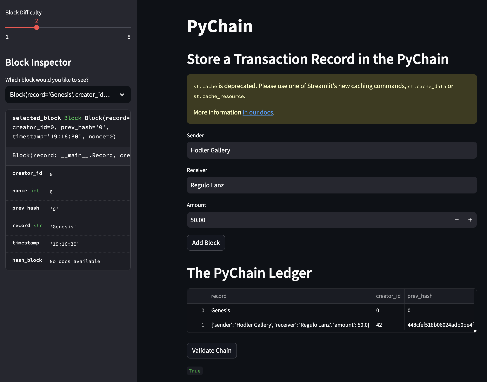

# PyChain Ledger

PyChain Ledger is a simple blockchain implementation using Python. The project incorporates a proof-of-work algorithm and uses the Streamlit library to provide a user interface for blockchain interactions.

## Features

1. **Record Transactions:** PyChain allows for the recording of financial transactions with sender, receiver, and amount details.
2. **Block Mining:** Blocks in PyChain are mined using a simple proof-of-work algorithm. The difficulty of the algorithm can be adjusted in the user interface.
3. **Blockchain Validation:** PyChain incorporates a validation mechanism to ensure the integrity of the blockchain.
4. **User Interface:** PyChain utilizes Streamlit to create an interactive user interface for viewing the blockchain and adding new transactions.

## Installation

Ensure that you have Python 3.6 or later installed on your system.

1. Clone this repository:
```bash
git clone "git@github.com:regulolanz/PyChain-Ledger.git"
```

2. Install the required Python packages:
```bash
pip install streamlit pandas
```

## Usage

1. Navigate to the project folder in the terminal:
```bash
cd pychain
```

2. Run the Streamlit application:
```bash
streamlit run pychain.py
```

3. The Streamlit application will open in your default web browser. Enter details for the sender, receiver, and amount of the transaction, and click the "Add Block" button. 

4. To inspect the blockchain, select a block from the "Block Inspector" dropdown. The selected block's details will be displayed.

5. To verify the integrity of the blockchain, click the "Validate Chain" button.

## Screenshots

Here are some screenshots from the Streamlit application:

**Transaction Entry:**


**Blockchain Inspection:**


**Blockchain Validation:**


**Streamlit Application:**

